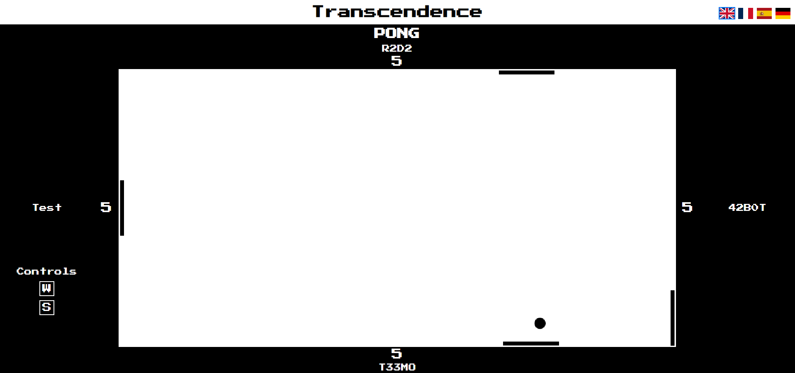
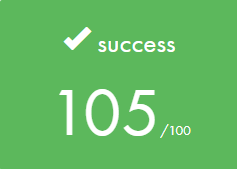

<div align="center">
  <h1>⚙️ ft_transcendence (a <a href="https://42perpignan.fr/">42</a> project) ⚙️</h1>
  
  <p>Subject: <a href="en.subject.pdf">en.subject.pdf</a></p>
</div>
<div align="center">
  <h2>✅ Grade</h2>
  
</div><br>

## <div align="center">📄 Introduction</div>
This is the final project of 42 School. For this project, we were a 4-people team.
Special thanks to [Nicolas](https://github.com/Floperatok), [Gwénaëlle](https://github.com/SciGWood) and [Samuël](https://github.com/MaitreOg)!

This project consists in creating a Simple-Page Application website where users can play the Pong game and do tournaments.
When the mandatory part is done, we had to choose wisely some additionnal modules. For more informations, see the [subject](en.subject.pdf).
<br><br>

## <div align="center">🛠️ Features</div>
- **Backend:** Django (python framework)
- **Database:** PostgreSQL / redis
- **Security:** 2FA authentification / csrf and user tokens / https protocol
- Register / Login
- Classic Pong game
- Tournaments
- Multiplayers Pong game
- Functionnal AI with difficulty selection
- **Profile customization:** Edit profile / Add friends
- **4 languages:** English / French / Spanish / German
- Live chat
- *Running on localhost*
<br><br>

## <div align="center">💻 Usage</div>
Open a bash terminal and type the following commands to run the project.

**Install Docker** if not installed yet (if you have any problem during the installation, please refer to the [Docker official documentation](https://docs.docker.com/engine/install/ubuntu/)):
```sh
sudo apt update && sudo apt upgrade -y
```
```sh
sudo apt install apt-transport-https ca-certificates curl software-properties-common -y
```
```sh
curl -fsSL https://download.docker.com/linux/ubuntu/gpg | sudo gpg --dearmor -o /usr/share/keyrings/docker-archive-keyring.gpg
```
```sh
echo "deb [arch=$(dpkg --print-architecture) signed-by=/usr/share/keyrings/docker-archive-keyring.gpg] https://download.docker.com/linux/ubuntu $(lsb_release -cs) stable" | sudo tee /etc/apt/sources.list.d/docker.list > /dev/null
```
```sh
sudo apt install docker-ce -y
```
```sh
sudo usermod -aG docker ${USER}
```
<br>**Install Docker Compose** if not installed yet:
```sh
sudo curl -L "https://github.com/docker/compose/releases/latest/download/docker-compose-$(uname -s)-$(uname -m)" -o /usr/local/bin/docker-compose
```
```sh
sudo chmod +x /usr/local/bin/docker-compose
```
<br>Clone the project's repository:
```sh
git clone https://github.com/Arawyn42/42_transcendence transcendence
```
<br>Enter the directory:
```sh
cd transcendence
```
<br>Setup the environment file:
```sh
cp dev.env .env && nano .env
```

<br>You can set the variables in the .env file like you want. For example:
```
# Transcendence environment variables
# Copy this file under the name ".env" and fill the blank values

# == DJANGO ==
DJANGO_SECRETKEY="thisisasecret"

# == POSTGRESQL ==
DB_NAME="mydatabase"
DB_USER="johndoe"
DB_PASS="mypassword"
DB_HOST="mydbhost"

# == EMAIL ==
EMAIL_HOST_USER="youremail@gmail.com"
EMAIL_HOST_PASSWORD="16 characters application password"

```
For the *EMAIL_HOST_USER* and *EMAIL_HOST_PASSWORD*, **you need to create a gmail address and [an application password](https://support.google.com/mail/answer/185833?hl=en)** on this mail adress.

<br>Create a folder for the database docker volume:
```sh
mkdir data && sudo chown -R $USER:$USER data && chmod -R 755 data
```
<br>Build and run the project with docker compose: 
```sh
docker compose up -d --build
```

<br>**Connect to the site!** In your browser, go to this url:
```
https://localhost
```